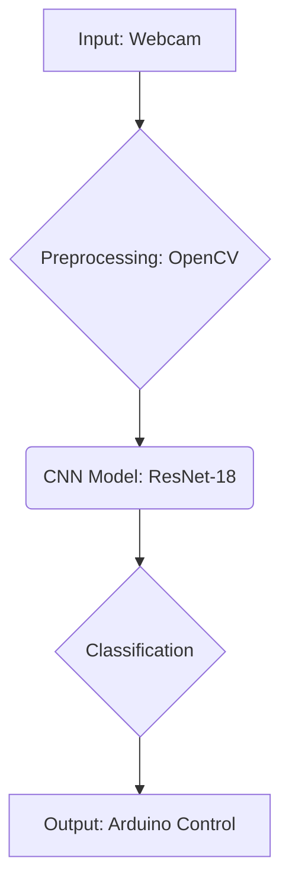

# Deep Chair 🪑


[](https://www.python.org/)
[](https://opensource.org/licenses/MIT)

A deep learning-based facial gesture analysis system for motorized wheelchair control. This project was developed as a final project for a BSc in Computer Science at UPSIN in 2018.

## Project Overview

Deep Chair uses computer vision and a deep learning model to analyze facial gestures in real-time. The system captures video from a webcam, classifies the user's facial gesture using a fine-tuned ResNet-18 model, and sends control signals to an Arduino to operate a motorized wheelchair.

## Architecture



## Features

- 📹 **Real-time Control:** Live facial gesture detection and classification from a webcam feed.
- 🧠 **Advanced AI Model:** Uses a fine-tuned **ResNet-18** Convolutional Neural Network (CNN) for robust image classification.
- 🎮 **5-Class Gesture System:** Recognizes 5 distinct states:
    - **Neutro** (Neutral) - Stop
    - **Arriba** (Up) - Move Forward
    - **Abajo** (Down) - Move Backward
    - **Izquierda** (Left) - Turn Left
    - **Derecha** (Right) - Turn Right
- ⚡ **GPU Acceleration:** Supports CUDA for high-performance inference.
- 🔌 **Hardware Integration:** Direct serial communication with Arduino for motor control.

## Technologies

- **Core:** Python 3.x
- **AI/ML:** PyTorch, Torchvision
- **Vision:** OpenCV, scikit-image, PIL
- **Data:** NumPy, Pandas, Matplotlib
- **Hardware:** PySerial, Arduino

## Installation

### Prerequisites
- Python 3.6+
- CUDA-capable GPU (optional, but recommended for best performance)
- Webcam
- Arduino Board (e.g., Uno, Mega) connected via USB

### Setup

1.  **Clone the repository:**
    ```bash
    git clone https://github.com/adcondev/deep-chair.git
    cd deep-chair
    ```

2.  **Install dependencies:**
    ```bash
    pip install torch torchvision opencv-python numpy pandas matplotlib scikit-image pyserial pillow
    ```

3.  **Hardware Setup:**
    -   Connect your Arduino to the computer.
    -   Ensure the Arduino is loaded with the appropriate firmware to interpret serial characters ('0'-'4') and drive the motors.
    -   Verify the COM port (the script automatically attempts to find an Arduino, but having it ready is essential).

## Usage

### 1. Training the Model (Transfer Learning)
If you want to train the model on your own dataset:
1.  Create a folder named `DataSetFacial`.
2.  Inside, create two subfolders: `Entrenamiento` (Training) and `Validacion` (Validation).
3.  Inside each of those, create folders for each class: `Abajo`, `Arriba`, `Derecha`, `Izquierda`, `Neutro`.
4.  Place your images in the respective folders.
5.  Run the training script:
    ```bash
    python TransferLearning.py
    ```
    *This will train the ResNet-18 model and save the best weights to `Resnet18Facial.pth`.*

### 2. Running the Control System
To start the wheelchair control system:
1.  Ensure your webcam is connected.
2.  Connect the Arduino.
3.  Run the main script:
    ```bash
    python ControlFacial.py
    ```
4.  **Operation:**
    -   The system will open a window showing the webcam feed.
    -   The predicted gesture and confidence will be displayed.
    -   Control signals are sent to the Arduino in real-time.
    -   Press `ESC` to exit the application.

## Contributing

Contributions are welcome! If you have any suggestions or improvements, please feel free to open an issue or submit a pull request.

1.  Fork the Project
2.  Create your Feature Branch (`git checkout -b feature/AmazingFeature`)
3.  Commit your Changes (`git commit -m 'Add some AmazingFeature'`)
4.  Push to the Branch (`git push origin feature/AmazingFeature`)
5.  Open a Pull Request

## License

This project is licensed under the MIT License - see the [LICENSE](LICENSE) file for details.
