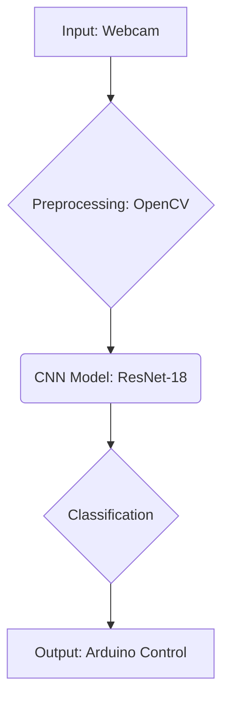

# Deep Chair 🪑


[](https://www.python.org/)
[](https://opensource.org/licenses/MIT)

A deep learning-based facial gesture analysis system for motorized wheelchair control. This project was developed as a final project for a BSc in Computer Science at UPSIN in 2018.

## Project Overview

Deep Chair uses computer vision and a deep learning model to analyze facial gestures in real-time. The system captures video from a webcam, classifies the user's facial gesture using a fine-tuned ResNet-18 model, and sends control signals to an Arduino to operate a motorized wheelchair.

## Architecture



## Features

- 📹 **Real-time Analysis:** Live facial gesture detection from a webcam feed.
- 🧠 **Deep Learning:** A fine-tuned ResNet-18 Convolutional Neural Network (CNN) for facial gesture classification.
- 🎯 **High Accuracy:** The model achieves a high classification accuracy (reported at 94%).
- ♿ **Accessibility:** Provides an alternative control method for users with limited mobility.

## Technologies

- **Python**
- **PyTorch**
- **OpenCV**
- **NumPy** & **Pandas**
- **Matplotlib**
- **Arduino**

## Installation

1.  **Clone the repository:**
    ```bash
    git clone https://github.com/your-username/deep-chair.git
    cd deep-chair
    ```

2.  **Install the required Python libraries:**
    ```bash
    pip install torch torchvision opencv-python numpy pandas matplotlib scikit-image pyserial
    ```

3.  **Set up the Arduino:**
    -   Upload the appropriate motor control sketch to your Arduino.
    -   Connect the Arduino to your computer via USB.

## Usage

1.  **Train the model (optional):**
    -   Organize your custom dataset into `Entrenamiento` (Training) and `Validacion` (Validation) folders.
    -   Run the transfer learning script:
        ```bash
        python TransferLearning.py
        ```
    -   This will generate a `Resnet18Facial.pth` file with the trained model weights.

2.  **Run the control application:**
    ```bash
    python ControlFacial.py
    ```
    -   The application will start, open the webcam, and begin sending commands to the Arduino based on your facial gestures.

## Contributing

Contributions are welcome! If you have any suggestions or improvements, please feel free to open an issue or submit a pull request.

1.  Fork the Project
2.  Create your Feature Branch (`git checkout -b feature/AmazingFeature`)
3.  Commit your Changes (`git commit -m 'Add some AmazingFeature'`)
4.  Push to the Branch (`git push origin feature/AmazingFeature`)
5.  Open a Pull Request

## License

This project is licensed under the MIT License - see the [LICENSE](LICENSE) file for details.
